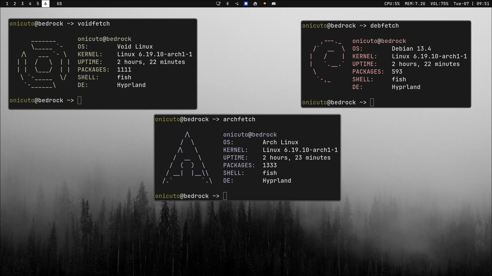

# dotfiles

Personal Linux dotfiles for an Bedrock Linux desktop built around Hyprland.

## Preview



## Stack

- WM: Hyprland
- Bar: Waybar
- Launcher: Wofi
- Shell: Fish
- Terminal: Ghostty
- Editor: Neovim

## Layout

```text
.
├── .config
│   ├── hypr
│   ├── waybar
│   ├── wofi
│   ├── nvim
│   ├── fish
│   ├── ghostty
│   ├── btop
│   ├── cava
│   ├── fastfetch
│   ├── neofetch
│   ├── gtk-3.0
│   ├── gtk-4.0
│   ├── qt5ct
│   ├── qt6ct
│   ├── nwg-look
│   └── Thunar
└── .icons
```

## Install

Clone the repo:

```bash
git clone <your-repo-url> ~/.dotfiles
cd ~/.dotfiles
```

Create symlinks for the configs you want:

```bash
stow .
```

Create backups first if you already have local configs.

## Dependencies

The setup expects at least some of these packages to be installed:

- `hyprland`
- `waybar`
- `wofi`
- `ghostty`
- `fish`
- `neovim`
- `fastfetch`
- `btop`
- `cava`
- `thunar`
- `qt5ct`
- `qt6ct`
- `nwg-look`

Package names may differ depending on your distribution.

## Customization

- Edit [`.config/hypr/hyprland.conf`](/home/onicuto/.dotfiles/.config/hypr/hyprland.conf) for monitor, input, animation, and general layout settings.
- Edit [`.config/hypr/binds.conf`](/home/onicuto/.dotfiles/.config/hypr/binds.conf) for keybindings.
- Edit [`.config/waybar/config`](/home/onicuto/.dotfiles/.config/waybar/config) and [`.config/waybar/style.css`](/home/onicuto/.dotfiles/.config/waybar/style.css) for bar modules and styling.
- Edit [`.config/wofi/style.css`](/home/onicuto/.dotfiles/.config/wofi/style.css) for launcher appearance.
- Edit [`.config/fish/config.fish`](/home/onicuto/.dotfiles/.config/fish/config.fish) for aliases, environment variables, and session startup behavior.
- Edit [`.config/ghostty/config`](/home/onicuto/.dotfiles/.config/ghostty/config) for terminal theme, font, and behavior.

